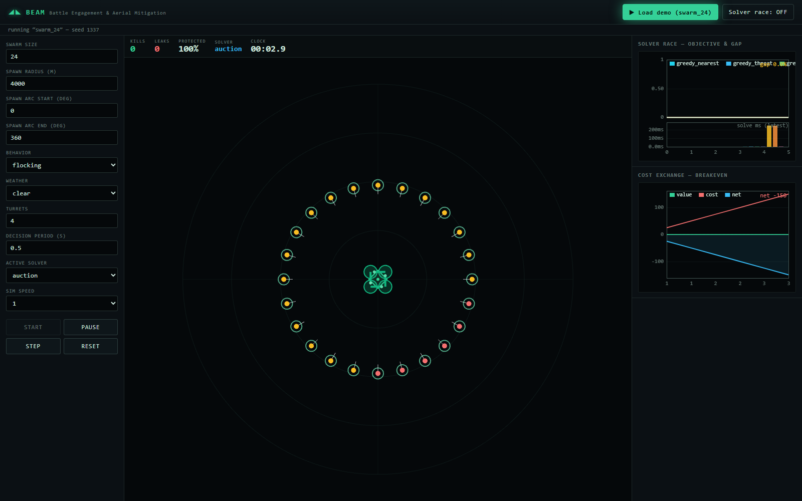
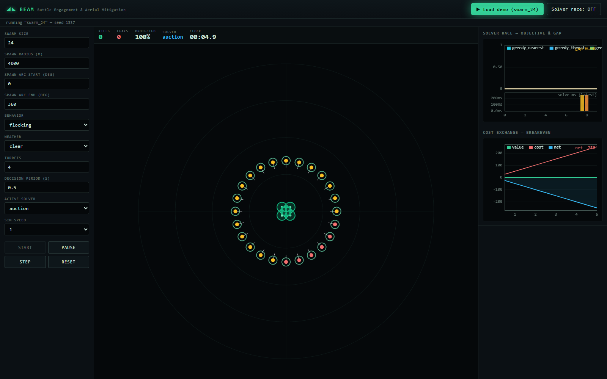

<div align="center">

# BEAM

**B**attle **E**ngagement & **A**erial **M**itigation

A real-time simulation that models a multi-turret laser battery defending an asset against a drone swarm, and solves the targeting decision as a live **Dynamic Weapon-Target Assignment** problem with an exact optimality reference.


</div>

---

## What this is

Drone swarms are cheap. The systems that stop them are not. BEAM simulates that exact tension and asks the question that actually matters: *can a laser battery kill drones faster than they arrive, and at what point does it pay for itself?*

Under the hood, the targeting problem is treated as what it really is in the operations-research literature, a **Weapon-Target Assignment (WTA)** problem, which is NP-complete. A single laser beam is not parallel hardware. It is one resource that must service targets in sequence, each needing a dwell time to kill, with slew time between targets and a deadline equal to each drone's time-to-impact. That makes it a **single-machine scheduling problem with sequence-dependent setup times and hard deadlines**, run across parallel turrets. BEAM solves it live, every decision epoch, with five interchangeable solvers including an exact CP-SAT reference, and shows you how close each one gets to optimal and how fast.

It is a simulation and analysis tool. No hardware, no real weapon parameters, all physics constants are illustrative and live in config.

## Two things it shows you, live

**Solver race with optimality gap.** Greedy baselines, an auction assignment, a metaheuristic, and an exact CP-SAT solver all run on the identical seeded scenario each epoch. You watch each policy's objective, its gap from the proven optimum, and its solve time stream in real time. This is the central tradeoff of the whole field made visible: good-enough-and-fast versus optimal-but-too-slow as the swarm scales.

**Cost-exchange breakeven curve.** A ledger tracks per-shot energy cost, amortized system cost, and maintenance against the cumulative value of drones destroyed. Per shot the laser wins instantly. The multimillion battery only goes net-positive past a volume of intercepts. That crossover is the chart.

## Demo

<p align="center">
  <br/>
  <em>Live run — <code>swarm_24</code>, seed 1337, <code>auction</code> solver. Four turrets defend the asset against a 24-drone swarm; the right rail streams the solver-race objective/gap and the cost-exchange breakeven curve in real time.</em>
</p>

<p align="center">
  <br/>
  <em>Seconds later — the swarm has pressed inward and the cost ledger's net position tracks every shot's energy spend against destroyed value.</em>
</p>

> Real captures of the running Pixi.js frontend (`beam serve` + `npm run dev`, then **▶ Load demo (swarm_24)**). Animated GIFs of the full engagement are captured per the same flow.

---

## Quickstart

### Prerequisites

- Python 3.11+
- Node.js 20+
- (optional) [`uv`](https://github.com/astral-sh/uv) for faster Python installs

### 1. Backend

```bash
cd backend
python -m venv .venv && source .venv/bin/activate      # or: uv venv
pip install -e .                                        # or: uv pip install -e .
beam serve                                              # FastAPI + WebSocket on :8000
```

### 2. Frontend

```bash
cd frontend
npm install
npm run dev                                             # Vite dev server on :5173
```

Open **http://localhost:5173**, pick a preset scenario, and hit Run.

### 3. Headless (no UI)

Run a scenario to a telemetry log, or sweep parameters to generate the breakeven and gap-vs-scale curves:

```bash
beam run   --scenario config/scenarios/swarm_24.yaml --solver auction --seed 1337
beam batch --scenario config/scenarios/swarm_24.yaml --sweep config/sweeps/breakeven.yaml
```

Artifacts land in `runs/` (telemetry, summary JSON, and CSV series for plotting).

---

## How it works

### The optimization

Each decision epoch BEAM snapshots the live world (targets, turrets, ranges, time-to-impact, thermal state) and re-solves the assignment. The objective is to **maximize the value of drones killed before they reach the asset** (equivalently, minimize leaked value). Per turret, completion time accumulates slew time plus dwell time along the chosen target order; a drone is killed only if its completion time beats its deadline and the turret's thermal budget allows it. Across the battery this is parallel-machine assignment on top of per-turret sequencing.

The exact CP-SAT model gives the optimum for small instances, which is what every heuristic's gap is measured against. Above a configurable target count the exact solve is time-boxed and throttled, and the UI honestly labels gaps as referenced-to-last-exact rather than faking a number.

### The physics (illustrative, all in config)

| Constraint | Model |
|---|---|
| Atmospheric attenuation | Beer-Lambert: delivered power falls as `exp(-alpha · range)`, with `alpha` set per weather profile (clear, haze, rain, fog, dust) |
| Dwell-to-kill | `energy_to_kill / deposition_rate`, where deposition degrades with range and track quality |
| Slew | sequence-dependent setup: `angular_distance / slew_rate + settle_time` |
| Thermal | turrets heat while firing, cool while idle, and are forced into cooldown at the cap, limiting duty cycle |

These four constraints are what turn targeting from a toy selection into a genuine scheduling problem, and they are the reason the swarm can sometimes win.

---

## Solvers

All solvers implement one interface and are fully interchangeable. Add a new one by implementing `solve(state, deadline_ms) -> Assignment`.

| Solver | Type | Role |
|---|---|---|
| `greedy_nearest` | Greedy | baseline floor |
| `greedy_threat` | Greedy | prioritizes value-per-urgency |
| `greedy_urgent` | Greedy | tightest still-killable deadline first (usually the strongest greedy) |
| `auction` | Linear assignment | fast, classic, strong |
| `ga` / `sa` | Metaheuristic | anytime; smart and scalable; returns best-so-far at deadline |
| `cp_sat` | Exact (OR-Tools) | optimal reference; provides the gap baseline |

---

## Architecture

```
Frontend (TypeScript, Pixi.js)
  battlefield canvas · control panel · gap & breakeven dashboards · solver-race split
        ▲ WebSocket (telemetry)   │ REST (control)
        │                         ▼
Backend (Python)
  FastAPI + WebSocket
  Sim Engine (physics, kinematics, kill resolution, decision loop)
     → Solver Suite (greedy · auction · metaheuristic · CP-SAT)
     → Cost Ledger
     → Telemetry / Replay
  numpy (vectorized physics) · OR-Tools (CP-SAT)
```

The engine, solvers, and ledger run fully headless for batch sweeps. The frontend is a thin renderer over the telemetry stream; all truth lives server-side, and runs are deterministic under a seed.

## Project structure

```
/
├── absolute-docs/pdd.md              # the spec / ground truth
├── README.md
├── backend/
│   ├── pyproject.toml
│   ├── beam/
│   │   ├── engine/     # kinematics, physics, kill resolution, loop
│   │   ├── solvers/    # greedy, auction, metaheuristic, cp_sat, base
│   │   ├── cost/       # ledger
│   │   ├── api/        # fastapi routes + websocket
│   │   ├── schemas/    # pydantic models
│   │   └── batch/      # headless sweeps
│   └── tests/
├── frontend/
│   ├── package.json
│   └── src/            # render, panels, charts, net, generated types
├── config/             # scenarios, sweeps, tunables (yaml)
└── docs/
```

## Configuration

Everything tunable lives in `config/`, never hard-coded: weather profiles, turret defaults, drone classes, cost constants, solver budgets, and sim cadence. See `config/defaults.yaml`. Every default is illustrative and exists to make the simulation internally consistent and demonstrable.

## Testing

```bash
cd backend && pytest          # physics, reproducibility, solver correctness
cd frontend && npm test
```

- **Physics:** monotonicity checks (kill time rises with range and worse weather; slew rises with angle), thermal cap behavior, energy conservation.
- **Solver correctness:** brute-force optimum equals CP-SAT on tiny instances; every heuristic objective is `<=` optimum with a non-negative gap.
- **Reproducibility:** same seed + solver yields a byte-identical telemetry hash (CI gate).
- **Contracts:** all REST/WebSocket payloads validated both ends.

## Deployment (Docker)

```bash
# Build and start backend (:8000) + frontend (:80) together.
docker compose up --build

# Production: set these in a .env file at the repo root:
#   CORS_ORIGINS=https://beam.example.com
#   PORT=8000
#   FRONTEND_PORT=80
#   BEAM_LOG_LEVEL=INFO
```

The backend container runs `beam serve --host 0.0.0.0`. The frontend container
builds the Vite app pointing at the backend (`VITE_API_URL` build arg) then serves
the resulting static files via nginx.

For local development the documented Quickstart (`beam serve` + `npm run dev`) is
faster. Docker is for hosted / CI deployments.

## Roadmap

- [x] Phase 1 — sim core (physics, kinematics, kill resolution, deterministic seeding)
- [x] Phase 2 — solver suite, optimality gap, cost ledger, streaming, batch sweeps
- [x] Phase 3 — frontend (battlefield, dashboards, solver-race split, tactical theme)
- [ ] Phase 4 — 3D view, scenario editor, adaptive (learning) swarm AI, shareable run links
- [ ] Multi-objective assignment (fold cost into the objective for a Pareto front)
- [ ] Rust hot loop for thousand-drone scale

## Contributing

`absolute-docs/pdd.md` is the authoritative spec. If code and the PDD disagree, that is a bug. Propose changes via PR against that file. New solvers and weather profiles drop in through their respective interfaces with no engine changes.

## References

- Lloyd & Witsenhausen (1986), NP-completeness of weapon allocation
- Kline, Ahner, Hill, survey of the Weapon-Target Assignment problem
- Leboucher et al. (2013), real-time WTA under the "before targets reach goal" deadline
- Google OR-Tools (CP-SAT), exact reference solver
- Reynolds (1987), Boids flocking model for swarm behavior
- Beer-Lambert law, atmospheric attenuation

## License

MIT.

> **Disclaimer.** BEAM is a software simulation and operations-research analysis tool. It does not design, specify, or provide engineering data for laser hardware or any weapon system. All physical parameters are illustrative and configurable for simulation purposes only.
